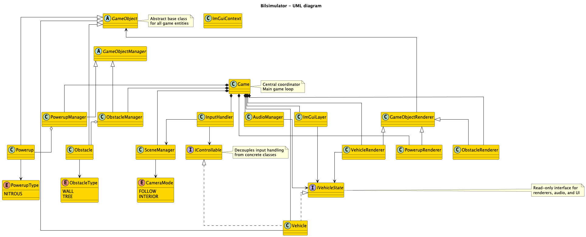
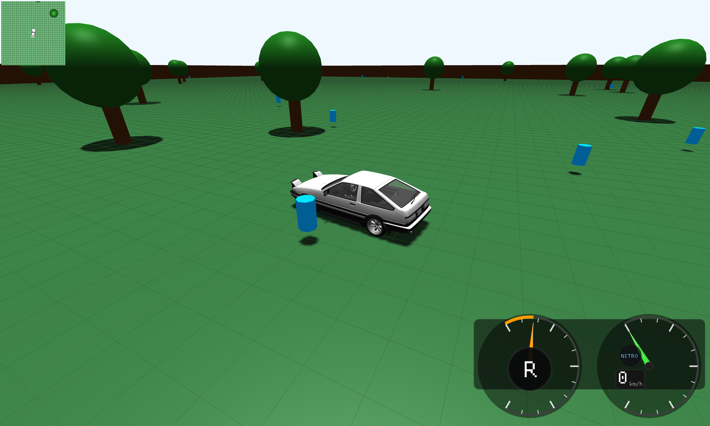
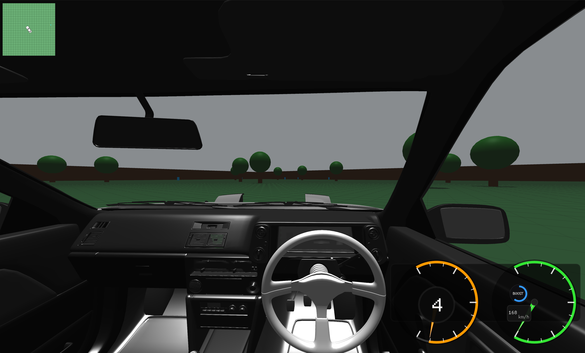

# Bilsimulator 🏎️

A 3D car simulator built with C++20.

## Features

- 3D car driving with realistic physics
- Drifting and nitrous boost
- Multiple camera views
- Sound effects
- Collision detection

## Controls

- **W/S** - Forward/Backward
- **A/D** - Turn left/right (steering)
- **Space** - Drift
- **F** - Nitrous boost
- **C** - Change camera
- **Arrow Keys** - Look directions (camera control)
- **R** - Respawn
- **ESC** - Exit game

## Architecture

### UML Diagram

For more details, see [ARCHITECTURE_AND_CONVENTIONS.md](docs/ARCHITECTURE_AND_CONVENTIONS.md).
